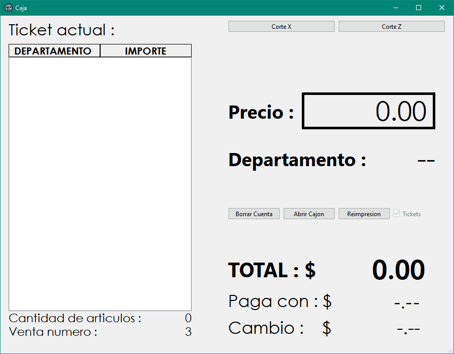

# SimpleCashier

SimpleCashier es una aplicación desarrollada en Qt 6.5.2 que sirve como un cajero sencillo, pensado para reemplazar cajas de cobro antiguas sin la necesidad de tener un punto de venta completo. El programa permite la impresión de tickets con impresoras térmicas de 80 mm y la apertura de cajón de dinero. Además, si se dispone de una base de datos MySQL de SICAR Punto de Venta, se puede conectar para buscar el precio de un artículo por código EAN/UPC. SimpleCashier soporta la fácil adición y modificación de departamentos mediante archivos de configuración hasta un máximo de 99, además es capaz de producir Corte Z y Corte X.

## Requisitos

- Qt 6.5.2
- MinGW 11.0
- Impresora térmica de 80 mm
- Base de datos MySQL de SICAR Punto de Venta (opcional)

## Instalación

1. Clona este repositorio en tu máquina local.
2. Realiza la instalación de Qt 6.5.2 y MinGW 11.0 en tu sistema.
3. Compila el proyecto y genera el archivo ejecutable (`CajaSUPER.exe`).
4. Si deseas utilizar la consulta con SICAR, configura la IP del servidor y las credenciales de acceso en el archivo `ip_server.txt`.
5. Configura los departamentos utilizando el archivo `departamentos.txt`. El número de línea indica el número de departamento y el contenido de la línea es el nombre del departamento.

## Uso

Para utilizar SimpleCashier:

1. Ingresa el precio del producto. La tecla de punto (.) en el teclado numérico añade un cero, y la tecla cero (0) añade dos ceros. Presiona Enter.
2. Ingresa el número de departamento del producto. Esto agregará el artículo a la lista del ticket. Repite este paso para cada producto.
3. Para finalizar la venta, presiona la tecla Espacio.
4. Ingresa la cantidad con la que paga el cliente y presiona Enter. Aparecerá el cambio a devolver.

Para búsqueda de producto proveniente de SICAR Punto de Venta:

1. Presione F12, se abrirá una ventana extra para realizar la búsqueda.
2. Teclee los últimos dígitos de la clave de producto (EAN/UPC) para búsqueda por reelevancia, o escanee el código de barras.
3. Una vez encontrado el producto deseado, escriba los dos dígitos de departamento y presione Enter.
4. El monto del producto se añadirá al ticket.

Otras funciones : 
1. Para ingresar múltiplos de productos digite la cantidad, seguido de asterisco (*) y luego proceda introducir el producto de manera normal.
2. Borre productos del ticket presionando dos veces la tecla Suprimir (Del o Supr)
3. Los botones de funciones Corte X, Corte Z, Abrir Cajon, Reimpresion de Ticket, tiene atajos de teclado, revise el archivo de ui.

## Contribuciones y Uso del Código

Este proyecto se ofrece como un recurso abierto para la comunidad, destinado a servir como ejemplo de un cajero sencillo desarrollado en Qt. Si bien puedes utilizar este código como base para adaptarlo a tus propias necesidades comerciales y realizar modificaciones para tu negocio, te animamos a hacerlo de manera responsable.

Valoramos y apoyamos la creatividad y la innovación en la adaptación de este código a diferentes contextos empresariales. Si decides hacer ajustes o mejoras, te sugerimos hacer un fork del repositorio y trabajar en tu propia versión del código.

## Contacto y Dudas

Si tienes alguna pregunta o duda sobre este proyecto, no dudes en ponerte en contacto enviando un correo electrónico a perrusquia832@gmail.com.

## Licencia

Este proyecto está bajo la Licencia MIT.
